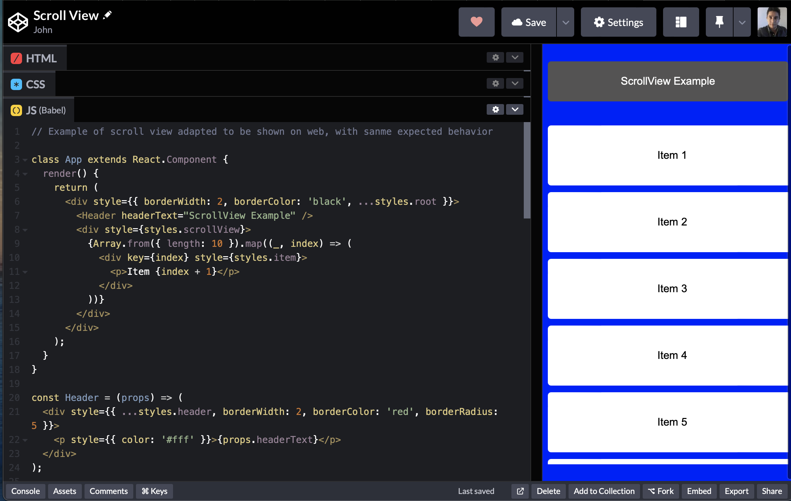

# ScrollView Extra Space Issue Solution

This describes the solution of a problem with a `ScrollView` component where unexplainable bottom space is showed. 

## Problem

**Tittle:** React Native ScrollView Empty Space (flexGrow behaviour) #43138

**URL:** facebook/react-native#43138

**Description:** Description: The issue is that the ScrollView component has added extra spacing at the bottom which this should not be there. The expected behavior is that the area is directly below the ScrollView and any additional space should not exist

**Labels**

**Component:** ScrollView
**Issue:** Author Provided, Repro, Newer.


## Solution

The implementation of this involves setting up the `ScrollView` and its content container changes, so that there are spare spaces that are unnecessary and they are not contributing to the extra space. Below is the step-by-step solution process:

### Step 1: Adjust ScrollView Style

Check that `ScrollView` is not having some unusual margin or padding that might be adding the extra space. 

<br>

```jsx
<ScrollView style={{ flex: 1, padding: 0, margin: 0 }}>
  {/* Content */}
</ScrollView>
```
<br>

###  Step 2: Check Content Container
Go after removing the margin or padding from the container that defines the elements in the ScrollView dynamically. 
<br>

```jsx
<View style={{ paddingBottom: 0, marginBottom: 0 }}>
  {/* Elements */}
</View>
```
<br>

###  Step 3: Use contentContainerStyle Property
Adjust the contentContainerStyle of the ScrollView to style the inner container, and check that there are no whites spaces at the bottom. 

<br>

```jsx
<ScrollView contentContainerStyle={{ paddingBottom: 0 }}>
  {/* Elements */}
</ScrollView>
```

<br>

###  Outcome

Finally, we observe the scroll view works as expected, there is no extra space at the bottom of the screen now, resulting in a scroll-viewer who interacts with the content in a clear, consistent and intended manner. 
<br>


### Demonstration

The source code is available here:
[Link ScrollView,js](../ScrollView/ScrollView.js)

<br>

For a visual demonstration of the implemented solution,  visit the following link: See the demo Code Pen this is a web browser emulation version of the scroll view.


### Demo onlive - CodePen

[](https://codepen.io/john24alex/pen/eYogRae?editors=0010)

URL: https://codepen.io/john24alex/pen/eYogRae?editors=0010


### References


For more information on working with Flexbox in React Native, check out the following resources:

- [React Native Flexbox Documentation](https://reactnative.dev/docs/flexbox) - Official React Native documentation on Flexbox layout.

- [Taming React Native's ScrollView with Flex](https://medium.com/@peterpme/taming-react-natives-scrollview-with-flex-144e6ff76c08) - A Medium article by Peter Piekarczyk on handling ScrollView's layout using Flexbox in React Native.

- Chat GPT : convert From react native to codepen and react Native for web rendering.
